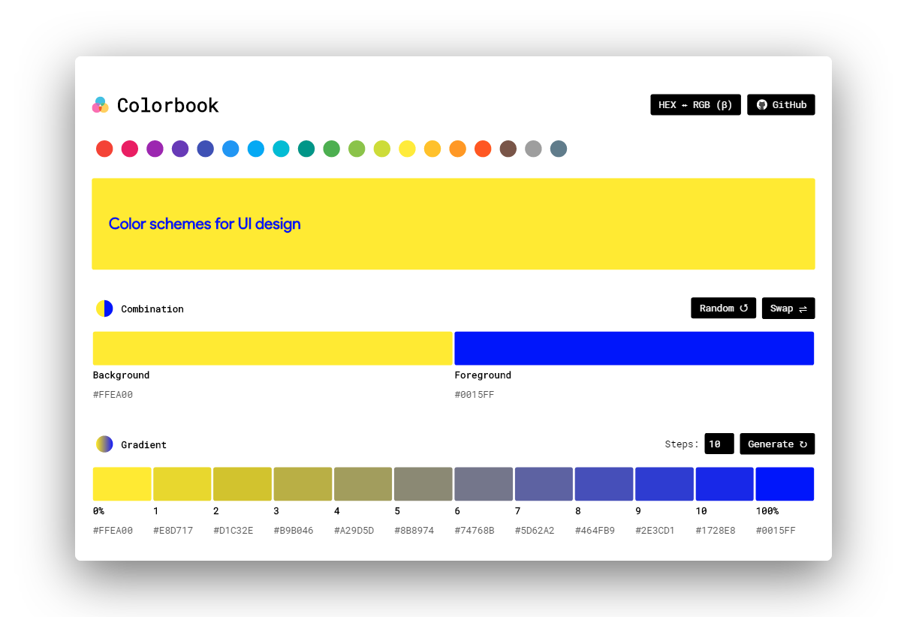
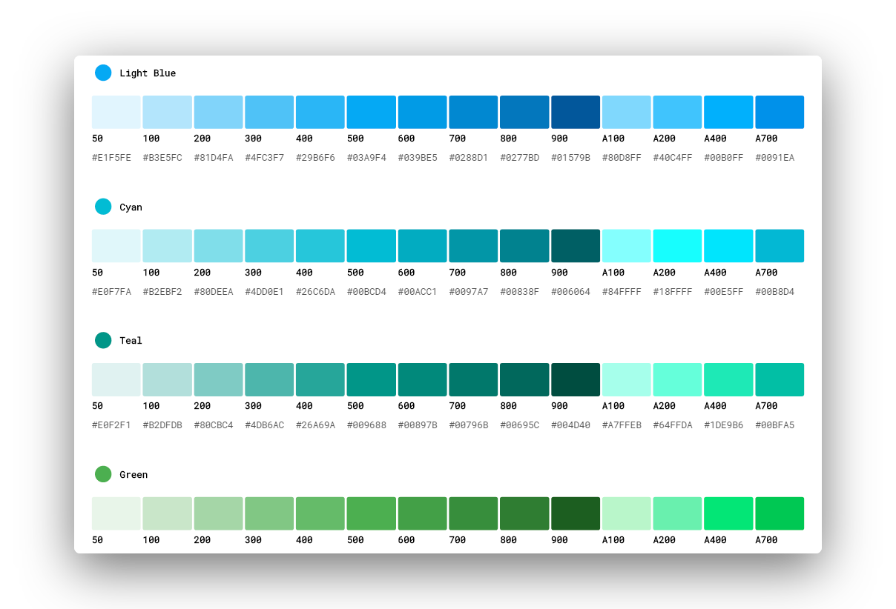

      

#  Colorpicker

### 🎨 Color scheme for Developers By [ZIYAN](https://github.com/ZIYAN-SER)

   
  
  
   

### Features :sparkles:

:heart: **Lightweight and minimal**: Crafted with minimalistic UI design

:electric_plug: **Real-time demo**: Pick a color, view a demo 

:zap: **Copy color codes to the clipboard**: Click on any color code to copy to clipboard!

:sparkles: **Choose custom colors**: Choose your own colors

:robot: **AI**: Generate combination colors for background and foreground

---

## Demo

[https://ZIYAN-SER.github.io/colorpicker](https://ZIYAN-SER.github.io/colorpicker)

1. Pick a color
2. View demo
3. Copy color codes

You're done!

---

## Built with

* **[Chromium](https://github.com/chromium/chromium)** - Thanks for being so fast!
* HTML - For the web framework
* CSS - For styling components
* JavaScript - For magic!

---

## Contributing

Please read [CONTRIBUTING](CONTRIBUTING.md) for details on our [CODE OF CONDUCT](CODE_OF_CONDUCT.md), and the process for submitting pull requests to us.

---

## Continuous Integration

We use [Travis CI](https://travis-ci.com) for continuous integration. Check out our [Travis CI Status](https://travis-ci.com/liyasthomas/colorbook).

---

## Versioning

This project is developed by [Liyas Thomas](https://github.com/liyasthomas) using the [Semantic Versioning specification](https://semver.org). For the versions available, see the [releases on this repository](https://github.com/liyasthomas/colorbook/releases).

---

## Change log

See the [CHANGELOG](CHANGELOG.md) file for details.

---

## Authors

### Lead Developers
* [**Liyas Thomas**](https://github.com/ZIYAN-SER) - *Author*

### Thanks
* [StackOverflow](https://stackoverflow.com)

See the list of [contributors](https://github.com/ZIYAN-SER/colorpicker/graphs/contributors) who participated in this project.

---

## License

This project is licensed under the [MIT License](https://opensource.org/licenses/MIT) - see the [LICENSE](LICENSE) file for details.

---

## Acknowledgments

* Hat tip to anyone who's code was used
* Inspirations:
	* [Dribbble](https://dribbble.com)
